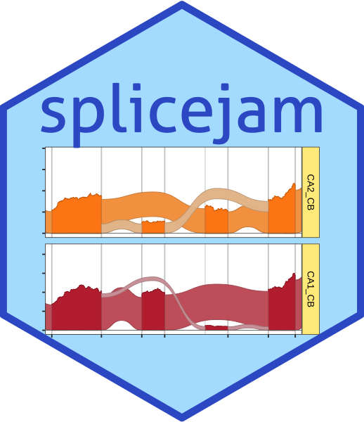
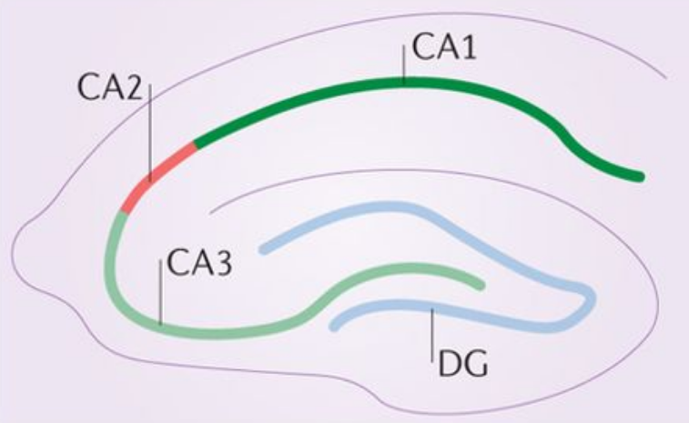

<!-- README.md is generated from README.Rmd. Please edit that file -->

```{r knitr_init, echo=FALSE}
knitr::opts_chunk$set(
  collapse=TRUE,
  warning=FALSE,
  message=FALSE,
  comment="#>",
  fig.path="man/figures/README-"
);
```

# splicejam 

Splicejam was created to analyze and visualize RNA-seq
and transcript isoform splicing data.
Splicejam aims to provide sashimi plots with enough
customizations to support publication-quality figures.

## Updates 28-July-2026

* The workflow is much simpler than pre-July-2026:

   1. One step to prepare the data `environment`.
   2. One step to create the figure, or open R-shiny app.

* Support for Bioconductor TxDb data package:

```R
sjenv_txdb <- splicejamDataFromTxDb(
   txdb=TxDb.Mmusculus.UCSC.mm10.knownGene::TxDb.Mmusculus.UCSC.mm10.knownGene,
   filesDF=filesDF,
   ann_lib="org.Mm.eg.db")
sashimiFigure(sjenv, gene="Gria1")
```

* Or prepare splicejam data using a GTF file:

```R
sjenv <- sashimiDataConstants(
   gtf=gtf,
   filesDF=filesDF)
sashimiFigure(sjenv, gene="Gria1")
```


## Splicejam Sashimi Plot

An example sashimi plot is shown below for the gene *Gria1*.
Each panel shows transcript expression in a region of mouse
hippocampus, where "CA1_CB" shows data that originated from
cell bodies of CA1, and "CA2_CB" shows corresponding data
from cell bodies of CA2.

In the example below `sjenvtest` is an `environment` which
contains the data necessary to create a Splicejam sashimi plot.

```{r, gria1_sashimi, fig.height=10, fig.width=14, alt="Splicejam sashimi plot for the gene 'Gria1'."}
suppressPackageStartupMessages(library(splicejam))
if (suppressPackageStartupMessages(require(GenomicRanges))) {
   data(sjenvtest);
   sjfig <- splicejamFigure(sjenv=sjenvtest,
      gene="Gria1",
      sample_id=c("CA1_CB", "CA2_CB"),
      use_memoise=TRUE,
      minJunctionScore=500)
}
```


<figure>

<figcaption>
A depiction of the CA1 and CA2 regions of mouse hippocampus
is shown in Fig 4a from 
<a href="https://dx.doi.org/10.1038/nrn.2015.22">Dudek et al. Nature Reviews Neuroscience(2016)</a>
</figcaption>
</figure>

<br>

## Features of a splicejam sashimi plot:

* The dark color polygons represent RNA transcript 
sequence coverage for exons in the Gria1 gene.
* Wide ribbons are drawn to indicate splice junctions,
areas where the sequences are aligned with a wide gap,
typically spanning two exons.
* The thickness of the ribbon (in height) represents
the number of aligned reads that span the gap,
usually about 70-80% the height of the adjacent exons.
* The ribbons are shaded light to dark based upon how
predominant the splice junction is from exon to exon.
The darkest ribbons represent the most predominant path
from exon to exon through the gene.
* Introns are drawn with a fixed width (along the x-axis)
and do not use genome coordinates. Introns are
normally about 100 times wider than exons, and when drawn
to scale obscure the detailed coverage of the exons.
The x-axis labels indicate genome coordinates.

## Sashimi plot at closer range

The plot can be zoomed using exon names, and argument
`use_exon_range`.

Notice the relative heights of the exons differ across CA1 and CA2,
consistent with the corresponding changes in splice junctions.
Clearly CA1 and CA2 favor different and mutually exclusive 
exons for Gria1.

```{r, gria1_sashimi_zoom, fig.height=10, fig.width=14, alt="Splicejam sashimi plot for the gene 'Gria1', zoomed in to show exon 13 through exon 16."}
sjfig_zoom <- splicejamFigure(sjenv=sjenvtest,
   gene="Gria1",
   sample_id=c("CA1_CB", "CA2_CB"),
   use_exon_range=c("Gria1_exon13", "Gria1_exon16"),
   use_memoise=TRUE,
   minJunctionScore=500)

```

Incidentally, these two isoforms of Gria1 represent the
["flop" and "flip"](https://www.sciencedirect.com/topics/neuroscience/gria1)
forms of the AMPA receptor complex. In human, the genes Gria2,
Gria3, and Gria4 comprise the AMPA receptor complex, and each
genes has two isoforms with "flop" and "flip" designations.

## Package Reference

A full online function reference is available via the pkgdown
documentation:

Full splicejam command reference:
[https://jmw86069.github.io/splicejam](https://jmw86069.github.io/splicejam)

The splicejam package is part of a suite of R packages
called "jampack" which is available through
GitHub, see [https://github.com/jmw86069/jampack](https://github.com/jmw86069/jampack)

## How to install

Install using the R package `remotes` and this command:

```
remotes::install_github("jmw86069/splicejam")
```

## About sashimi plots

Sashimi plots were originally envisioned by MISO, which introduced
the innovative idea to compress intron width in order to reveal
the detailed exon sequence coverage, and to highlight changes in
splice junctions.

Katz, Y, Wang ET, Silterra J, Schwartz S, Wong B, Thorvaldsdóttir H, Robinson JT, Mesirov JP, Airoldi EM, Burge, CB.
*Sashimi plots: Quantitative visualization of alternative isoform expression from RNA-seq data.*
http://biorxiv.org/content/early/2014/02/11/002576

Splicejam re-envisions classic sashimi plots by displaying splice junctions
as wide arcs proportional in size to the number of junction reads,
making them directly comparable to exon coverages on the same plot.
Inspired by:

* [Sankey plots](https://en.wikipedia.org/wiki/Sankey_diagram),
* [flow diagrams](https://en.wikipedia.org/wiki/Flow_diagram),
* [Alluvial diagrams](https://en.wikipedia.org/wiki/Alluvial_diagram).

These ribbons were ultimately made feasible to implement in R thanks to
the package [ggforce](https://ggforce.data-imaginist.com/) which
implemented [geom_diagonal_wide](https://ggforce.data-imaginist.com/reference/geom_diagonal_wide.html).

